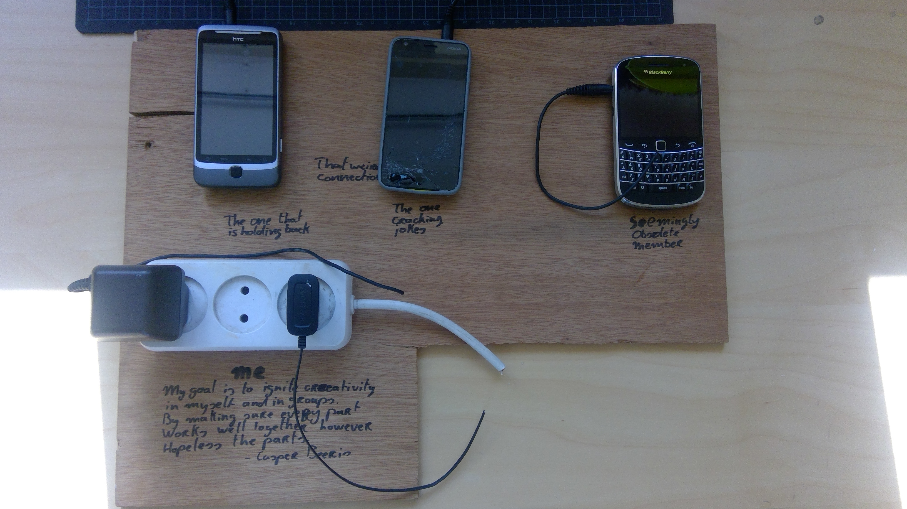
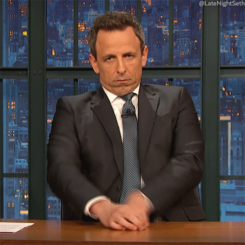
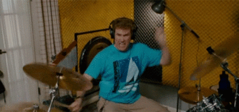
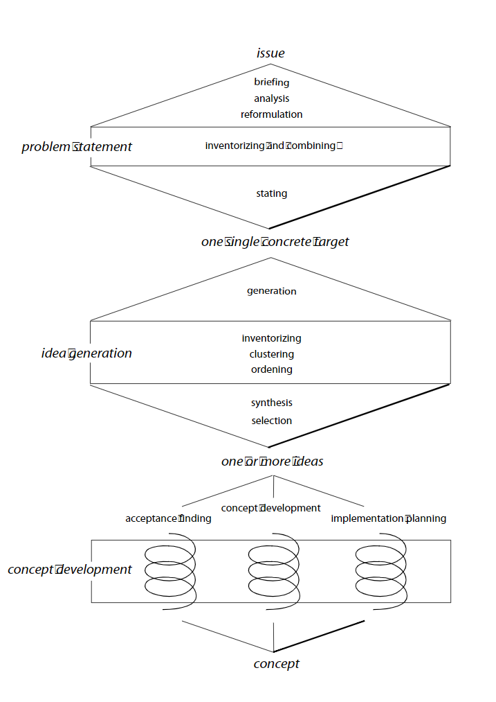
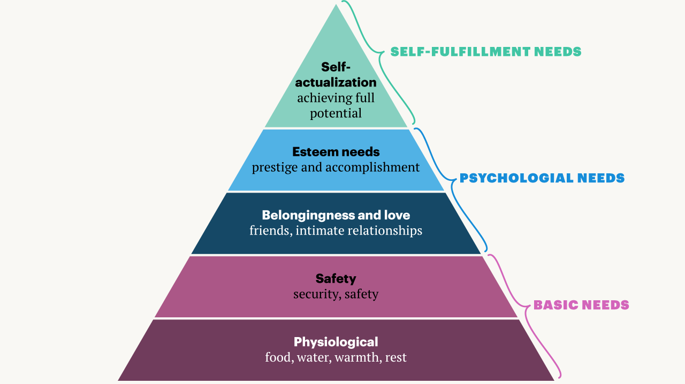
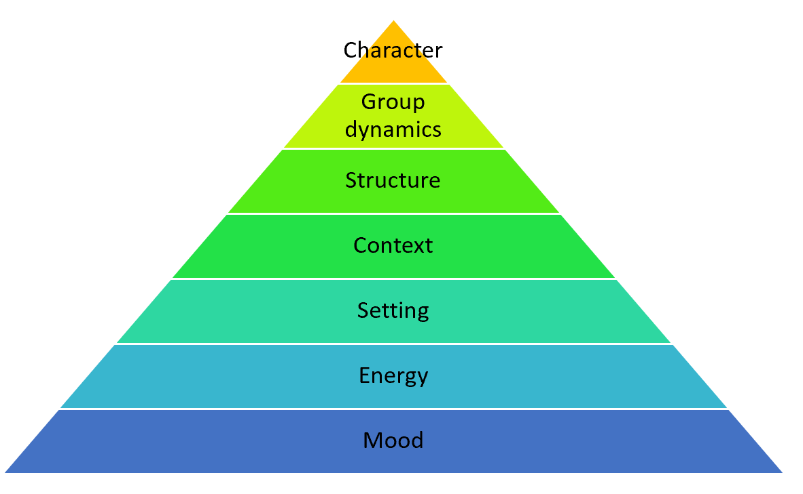

# &quot;Autumn 2019&quot;

Casper Beeris - 4975421

<iframe width="560" height="315" src="https://www.youtube.com/embed/8960FY_0FHo?start=405" frameborder="0" allow="accelerometer; autoplay; encrypted-media; gyroscope; picture-in-picture" allowfullscreen></iframe>

Set the mood of this report, start the video!
Pro-tip, let it play in the background while reading.

Before you start reading. You might want to consider:
Do you have coffee or tea at the ready?
And perhaps a snack?
Are you sitting in the right place? No disturbances?
The beach, a garden, your most relaxed chair?

This report was written with the idea in mind to give you, the reader, a pathway into my mind. I sincerely hope it will be an enjoyable pathway. 

# 1. Learning Contract
---

Knowing that I&#39;m mostly able to prepare a structured and flowing session with a lot of joy and enthusiasm. I thought of a way to challenge myself to get the most out of this course. My interest has always been with group dynamics. And with the CF sessions, you can see if a certain method is working for the group or not. This is why I came up with the following.

My learning contract represents the variety of people with which you make up a creative session. And the connections between them.

The old and obsolete: the one stuck in it&#39;s thinking pattern but very reliable and wise through his/her experience.

The silent but hidden gem: the one that is not able to speak up in groups or speaks up less. But when asked to say something he/she can contribute with a well thought through insight.

The boss: The one with the biggest mouth and a lot of idea&#39;s. But overshadows other team members and can be stuck in a critical mindset.

My goal was to unite these people and make sure that they would all be able to connect and add to the session. Adapting to the personalities of everyone in the room to ensure maximization of the thinking potential.

My strategy for tackling this goal was to engage with the participants in the room. By making conversation in breaks and during the assignments. And with the information that comes from this conversation adapt the planning to suit the way of collaboration and thinking styles of the participants.

A metaphor that came up during the presentation of the different contracts was the parallel between organizing a session and jazz. Everyone should be able to do their own thing and together it sounds as a whole. This has become my vision for my CF sessions. With me as the conductor.

# 2. Theory
---
This part will reference some sources that inspired my way of conducting creative sessions.
First and foremost the general structure:

This is simply the backbone of my sessions. Going from issue to target, from target to ideas and from ideas to a concept is a method that feels logical. However, most creative sessions are too long to go through all phases. Which means you will have to deal with the rough edges when cutting things short or starting halfway.

Secondly, Associations. Associations are undoubtedly the simplest form of inspiration. The fact that associations are a simple reliable form of inspiration makes them very useful in a creative session. Especially if all participants are not creatively schooled.

Thirdly, when conducting a session and paying attention to group dynamics Maslow's pyramid is important. This is also a way of tackling my learning goal. Using this principle one can see that before good group dynamics become a thing every person in the room has needs to be fulfilled before being able to think about full self-actualization. Importantly everyone needs to be well-rested, fed en feel safe before even thinking about psychological needs. Then people need to have the feeling that they have friends among them and feel valued. Only then the full potential of everyone in the room can be utilized.

The first basic need could be created by having timely rest moments and have plenty of food and water at the ready.
The second basic need, safety, can be created by developing clear ground rules. The rule of your two feet helps a lot. Furthermore breaking barriers of comfort by giving the example as a facilitator is useful.
Belonging and love can evolve from breaking up people into pairs. Giving prompts that help to get to know each other and start conversation should also result in the building of a relationship. As do experiences gone through together. 
It is essential to manage Esteem needs actively. As a facilitator, it is vital to ensure that everyone speaks up when they have something to add to the discussion. It happens that one participant is overshadowed by another. As the facilitator, you can work around this by giving people turns to speak or by giving everyone equal opportunity to add, for example with post-its.
The ultimate goal for everyone is full self-actualization. Only in this state people can come in a state of flow and will be able to add to their potential.

Therefore creative sessions need to start with developing basic and psychological needs. Such a start should also help to get the different people in the room to show their best side and subsequently result in less conflicting roles or irritations. Participants need to know when their skills are most useful. Just as in Jazz, musicians are all equally valuable but need to play their part at the correct timing. Incorrect timing hurts the beauty created. 

# 3. Internal Session
---
My Internal session was for Laura Schouwen. Who sought to improve patient handovers at the ICU by design.

## Intake
For the intake, we called Laura with a bunch of questions. Which are added in the appendix of the report. These questions gave a good insight into the problem to solve. What had been tried already and most importantly the expected outcome. Which in this case was as many original idea&#39;s as possible that would be used as inspiration for her project. She also provided us with a concise problem definition which proved to be very useful since all participants had no idea about the context.

## The plan

### 1.Game plan (outcomes & goals)
The goal was to generate as many ideas as possible. Therefore there was less focus on quality and more on quantity.
### 2.Determine flow of session
With this goal in mind, I wanted the session to gradually be more energetic. This was also because the session would be late at night. And people were bound to fall asleep if it would be a slow-moving exercise. So I opted for more physical assignments later in the session.
### 3.Modus operantis (I want to..)
I want to motivate and bring the inner child to the top of their minds. This will take empathy, seeing what every individual and the group needs in the room at that moment in time.
### 4.Choose tools/ assignments
I opted to use a meditation visualization to start and envision the stakeholders and their environment. Followed by an exercise to create a common goal and values. Thereafter I chose to incorporate many objects stimulated playful association games. That was clustered in the end.
### 5.Connect tools
The first exercise is quite slow. So to up the tempo, the first goal setting exercise is made to be like a scrum. Effectively forming them into a team ready to take on an important game. This team theme is then used throughout including pep talks and encouraging teamwork and building on each other's ideas.
## Reflection
---
### Mood
The mood of the group was good. The togetherness of the participants was alright and did certainly improve due to the break activities. I also got the feedback that they liked my enthusiasm and energy. Resulting in a safe and spontaneous working environment.

### Setting
The chosen setting in the dressing room of the facility was good noise and distraction wise. But it lacked working space and especially important, light.

### Time
I found it difficult to stay on time. Everything felt a bit rushed because of this and because I was feeling behind on time I didn&#39;t alter lower and higher pace activities. This also connected to the time of day and the dim lighting. Causing lower energy.

### Energy
The energy of the group was on the lower side. This resulted in one of the participants becoming less involved when we were two hours in. I tried to involve this person again and again but it was too late and he was too tired. Later I found that participating in the constant high pace activities and thinking of idea&#39;s was pretty brain frying. So for the next time, I would not do a session this late and if I have to would do it in in well-lit place altering the pace more and giving more room and time to think. My thought was to keep the energy and pace high to keep people from falling asleep which worked for quite a while but in the end was like trying to do a marathon in sprinting tempo.

### Context
The brief and intake questions proved to be adequate to get everyone on one page with the context. The used visualization was my favorite part of the session and is something I find unique and helps to envision who the group is designing for.

### Structure
The structure of the different activities behind each other worked well. There was a real sense of flow from one assignment to the next. Which I was pleased about. I was however surprised about the time it took to converge after all the idea&#39;s were generated. Making choices for certain idea&#39;s is quite hard especially when you try to conserve the richness of the idea&#39;s. This is something I still need to figure out.

### Group dynamics
There were no authority struggles among them and I had the feeling that I had just enough control over the group. However, I could have been a bit too much since I only later heard about the lack of energy.

### Personality
My session triggered the high energy outgoing people well. But is was a bit too much for the less energized. I tried to solve this by using techniques that let people work for themselves which worked to get a bit more out of them but not for too long. I also noticed that these forms of assignments were harder for me to evaluate the mood.

## Concluding
In general I&#39;m pleased with my first session. It was a good and fun experience and the results were good. I do think that there is room for improvement but this is only logical. I will put more attention to the setting, energy, and time constraints of the session to prevent the pitfalls of this session.

# 4. External Session
---
My external session was for Gerhard Visser, head of neurology within epilepsy research center SEIN.

## Intake
The intake with Gerhard and Hannah consisted of 2 rounds. The first one over the phone explaining the concept of a creative session. And a second one at SEIN by having a conversation with Gerhard and a co-worker(Hannah, Technical medicine) about the possibilities and finding a possible problem to brainstorm on. This went a lot tougher than the previous intake because of the lack of understanding of the creative facilitation concept. But with some explanation, we came to a resulting question: how can we use a mobile EEG recorder to provide clients with a home recording of EEG&#39;s. It helped a lot that I knew what the context was about via my girlfriend's graduation project at SEIN.

We also agreed upon a session with a wide variety of participants from different functions.

## The plan
### 1.Game plan (outcomes & goals)
The goal of the session was to generate new use cases of a mobile EEG recorder. This meant getting all different perspectives on the subject to a place where they would generate ideas and evaluate the applicability of the resulting concepts. Effectively walking through all three stages of the CF process in one afternoon.
### 2.Determine flow of session
The plan was to get people to start thinking freely more and more. I expected a withdrawn standpoint due to the hierarchical structure of most medical organizations. Therefore I opted for assignments that helped to give everyone a say in discussions.  
### 3.Modus operantis (I want to..)
I wanted to inspire free and creative thinking. This is my unique selling point in a session with medical professionals. And it would be my role to teach that to this target group.
### 4.Choose tools/ assignments
The session was divided into three parts of an hour each. The first one focussed on setting the scope. The second on ideation and the third on concept selection. Rules of conduct are the first step followed by describing everyone's roles. The problem owner could explain the problem. From which values for the solution could be created by asking a multitude of what if? questions and a purge of the initial ideas. The second part would consist of developing ideas for the problem using prompts and associations. The third and final part consisted of ranking the ideas on different graphs using the values that resulted from the first section.
### 5.Connect tools
Every assignment's result should be used in the next assignment. Especially the values created in the beginning could be used for selection and clustering in the end. I planned to keep the session quite basic looking at time constraints and the probably overwhelming experience of doing assignments that are different then the participants would do on an ordinary day.
## Reflection
---
### Mood
The mood of the group was alright during the session. I quickly noticed that the group was a lot stiffer than a group of IDE students. Which I expected. The best example was one of the participants looking at me with big eyes when I asked everyone to set the tables aside. This stiffness held up through the whole session. In hindsight, I could have used some crazy hats or other props to make everyone a bit looser. In the end, the environment I created was just too ordinary.

### Setting
The setting was good, moving the tables over in a conference room worked well to signal that this wasn&#39;t going to be a normal meeting.

### Time
Time was to tight. I scrapped a lot of my original assignment idea&#39;s in favor of the time and still ended up with too little to analyze the brought up idea&#39;s in the end.

### Energy
The energy of the group never peaked in extaticness but was overall well managed. I paced certain assignments differently according to the quality that needed to be produced at that moment. Which worked well.

### Context
This is where the session suffered a big loss. I assumed all participants to be on the same page with the problem statement developed 2 months earlier. Or even expected a further standpoint by now. But the problem statement that was developed was too far fetched and the first hour was spent on redeveloping what everyone wanted to work towards.

I think this was due to a lack of introduction by the problem owner but also the overestimation of the group&#39;s process by the problem owner. My assumption that everyone was on the same page didn&#39;t help either and we ended up going on to the design phase before the problem was solidly defined. I could have held an entire session of 3 hours just to find the right problem but didn&#39;t anticipate the importance of this and went on. Leaving the group feeling like they didn&#39;t tackle the right problem at the end of the session.

### Structure
If the problem is not defined clearly in the understanding of the whole group, don&#39;t go on. The session was, however, successful in finding what the group found important values for an eventual solution for SEIN&#39;s problems. So I&#39;m confident that the structure would have worked well if the problem was better defined. I again heard compliments on the flow of the assignments.

### Group dynamics
Working with medical professionals is a whole different ballgame than working with ID students. I expected a bigger difference in the hierarchy of the group and fewer design skills. Which was true but surprising to some extent. The hierarchy was quite alright but still with a boss in a back corner being critical and realistic about everything. The design skills were most surprising. I chose to go for association activities since they seemed most simple to quickly learn. But this was quite hard. I learned that medical professionals are really strong critical thinkers, a pattern that I found hard to reduce completely. Even with all kinds of different stimuli, they couldn&#39;t let go off this mindset.

The different professional roles in the group were noticeable. As well as who were friends and not. I could have mixed up the group a bit more to spread the more cheerful people between the people who were unsure of their added benefit to the group. I probably could have solved the problem of the latter with the rest of the group complimenting them on the insights that they could provide in this context.

### Personality
During the session, I played around by giving people different stimuli depending on their character. The critical boss got the assignment to come up with idea&#39;s that would be the ideas that would be contrary to the ideal solution. The more practical-minded nurse required some time to think on his own after all the stimulus of the whole day of work. The more problem solving technical medicine participants were mostly triggered by giving them examples of other company&#39;s and finding parallels to the problem they were looking into. This helped them mostly to come up with some extra idea&#39;s whenever they were stuck. The added benefit was that they became amazed by my quickness of coming up with the associations I used as examples. Gaining me some more respect which helped me to steer the group.

## Concluding
Everyone walked away happy but a little unfulfilled. And I would love to do another session with them knowing what I know now. The biggest adjustments would be a more spread out structure that allowed for the development of a strong problem, Idea&#39;s and quality control. Dividing them into three sessions. I am pleased to notice that the problems of the first session didn&#39;t repeat in this one. The pitfalls were logical in my opinion when switching from enthusiastic ID students to medical professionals.

This gives me the idea that there is a dependency of needs within a session that needs to be ensured before you can pay attention to the next level. Just like Maslow&#39;s pyramid.

# 5. Experiences, reflections, and learnings
---
I would like to summarize my learnings into two tools that can be easily implemented in the next sessions.

## Maslow&#39;s pyramid of CF:

The logic in this pyramid comes from my own experience. The mood is most important without it you will get nowhere. For example, you can have a group that has energy, but if people are grumpy and unwilling the session won't work. 

- Energy is more important then the setting of the session if the setting is bad but there is enough energy it will probably not matter. As can be seen with my internal session. The setting wasn't that good but it only became noticeable when the energy dropped. 
- The setting is more important then the context. With a good setting, you can start to develop a better understanding of the context of the problem. However, if the setting is horrible and you get interrupted constantly by noise or other factors it will hinder your progress.
- The structure is all about the build-up of the session. The session will not work if it isn't clear what everyone needs to be doing or the tools don't fit the moment.
- Group dynamics is the next thing to focus on as a facilitator. You will need the feeling of safety for everyone before people can start to use their character traits efficiently. 
- Character is, therefore, the top of this pyramid. If you, as a facilitator, want to get to the point where you can focus on how each person is best used in the session, you will need a sturdy basis to build upon.

This is why my learning goal was far fetched. It is more important to focus on the other parts of the pyramid first. But I hope my efforts at the beginning of the report have at least given you a good mood, energy, and setting. 

## Core skills of CF:
core skills are skills that are relevant in every activity within a creative session.
They are reminders of things you can do as a facilitator to improve the session no matter the level of the pyramid you are at.

1. Create safety
2. Dare to switch it up
3. Give time
4. Give ownership

All of the above skills I believe can be implemented in sessions in many many ways. 
- create safety when people are feeling insecure. Be clear in what you are going to do and what is expected from the participants. And give them a way out.
- Dare to switch it up if things don't go to plan it is more important that you move with the level of understanding the group is at then that you rush them through several steps. The latter can kill creativity.
- Don't rush, give time instead. A rushed session is detrimental to the quality of the choices made when converging ideas. 
- Give ownership is important since it allows you as a facilitator to monitor where the group wants to go. And if you don't have a way of knowing how your group is feeling you are steering blindly. It also sparks trust and creates a form of safety. You will want to steer your session fluently and not resist or oppose it.  

# 6. Recommendations for yourself
---
The best recommendation that I could give myself is to do more sessions. I have already used the tools to become a more creative industrial designer. And I think getting more familiar with the sessions will allow me to switch quickly between activities depending on what the group needs at that moment in time. Just like improvisation in Jazz. It is a high goal which is not yet achieved and I think that when you can be flexible with your sessions you master the subject.

# and for the CF staff
First of all, I loved the interactivity of the course. CF is something you learn by doing and your experience and personalities together made for a nice mix of styles from which I could pick and choose to form my own.

The thing that could improve would be the structuredness of the lectures. At times there were so many side paths to the main story that I lost the goal of the lecture or the lecture seemed to proceed very slowly. That said, al the anecdotes helped. So maybe schedule them in the lecture on the forehand?

# 7. appendix
---
**Kun je een voorbeeld geven van hoe het nu gaat? Wat zijn de stakeholders? En wat zijn hun rollen in dit proces?**

**Wat zijn de grootste problemen? Of wat moet er beter?**

**Wat is er al geprobeerd?**

**Hoe crazy zijn je crazy ideeën nu? Voorbeeld:**

**Wat is de oplossingsruimte? Waar kunnen we niets aan veranderen en waar juist wel?**

**Wat wil je eruit krijgen?**

**Wanneer is het succesvol? Wat zou de slechtste uitkomst zijn?**

**Wat wil je aan het einde hebben? 1 oplossing of zoveel mogelijk? Hoe concreet?**

